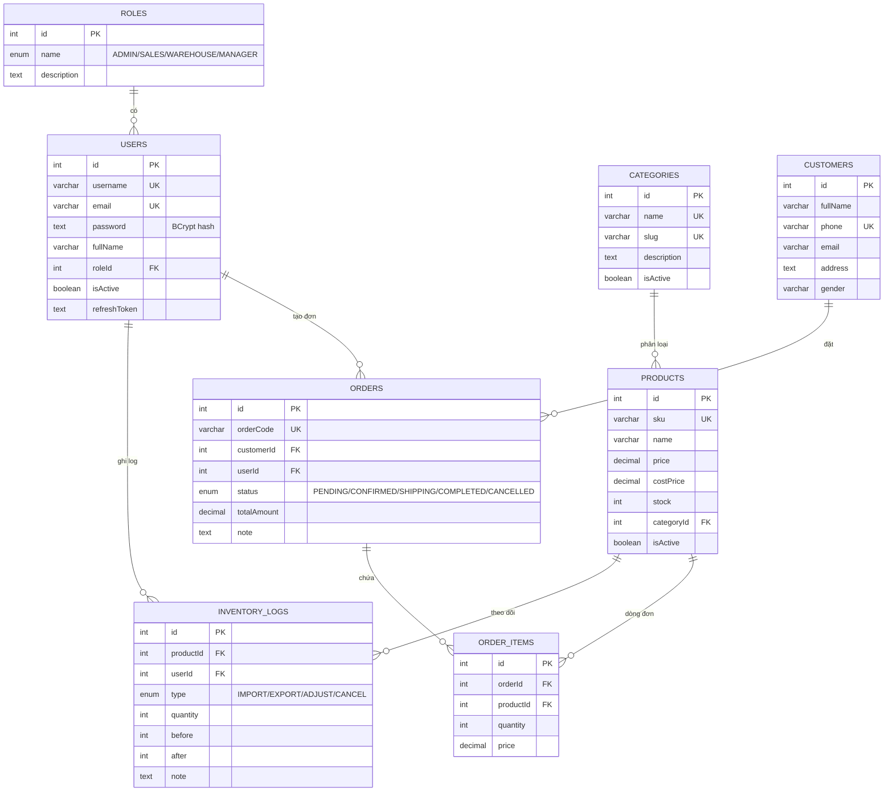

# ERD - Sơ đồ cơ sở dữ liệu

Dự án có **8 bảng**: `roles`, `users`, `categories`, `products`, `customers`, `orders`, `order_items`, `inventory_logs`.

## Sơ đồ quan hệ (Mermaid)

## Bảng tóm tắt

| Bảng | Khóa chính | Khóa ngoại | Ràng buộc / Index chính |
|---|---|---|---|
| `roles` | `id` | — | `name` UNIQUE |
| `users` | `id` | `roleId → roles.id` | `username`/`email` UNIQUE; index `roleId`, `email` |
| `categories` | `id` | — | `name`/`slug` UNIQUE; index `isActive` |
| `products` | `id` | `categoryId → categories.id` | `sku`/`slug` UNIQUE; index `categoryId`, `name`, `isActive` |
| `customers` | `id` | — | `phone` UNIQUE; index `fullName`, `phone` |
| `orders` | `id` | `customerId → customers.id`, `userId → users.id` | `orderCode` UNIQUE; index `customerId`, `userId`, `status`, `createdAt` |
| `order_items` | `id` | `orderId → orders.id`, `productId → products.id` | UNIQUE(`orderId`,`productId`); index `productId` |
| `inventory_logs` | `id` | `productId → products.id`, `userId → users.id` | index `productId`, `userId`, `createdAt` |

## Ràng buộc toàn vẹn chính

1. **Primary Key**: mọi bảng đều có `id SERIAL PRIMARY KEY`.
2. **Foreign Key**: 
   - `ON DELETE RESTRICT` cho quan hệ cha-con (không cho xóa sản phẩm/khách hàng/danh mục đang được tham chiếu).
   - `ON DELETE CASCADE` cho `order_items` khi xóa đơn hàng.
3. **Constraints**:
   - `username`, `email`, `sku`, `slug`, `phone`, `orderCode`, `roles.name` là UNIQUE.
   - `order_items.quantity` do schema/validate code kiểm soát > 0.
   - `orders.status` là ENUM giới hạn 5 trạng thái.
   - `inventory_logs.before/after` lưu số tồn trước/sau để báo cáo.
4. **Indexes**: index trên mọi khóa ngoại + cột hay lọc/tìm kiếm (`name`, `status`, `createdAt`, `phone`...).

## Script SQL

File migration đầy đủ (tạo enum + bảng + index + foreign key):
`backend/prisma/migrations/20260915233928_init/migration.sql`