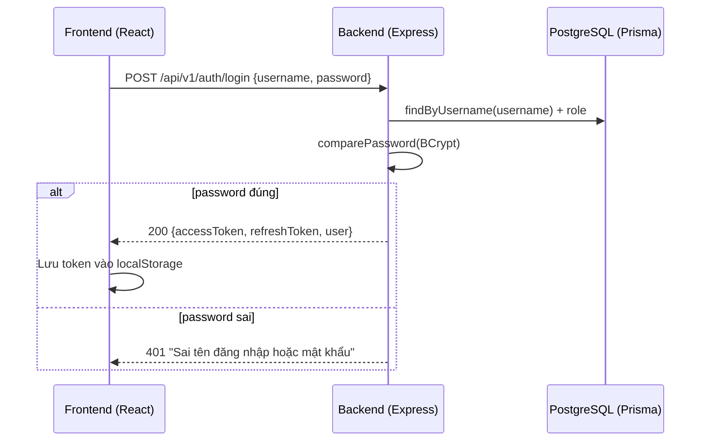
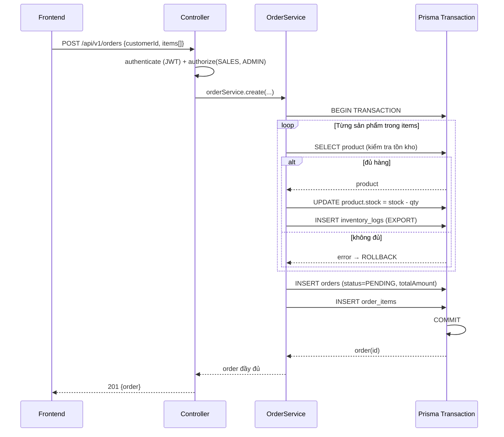
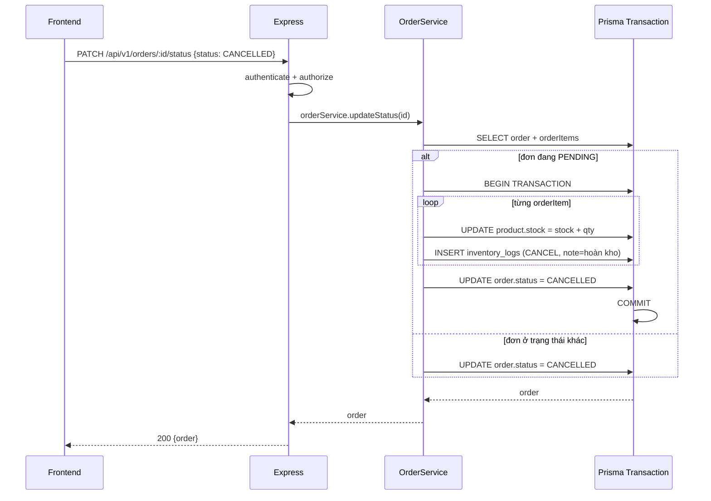
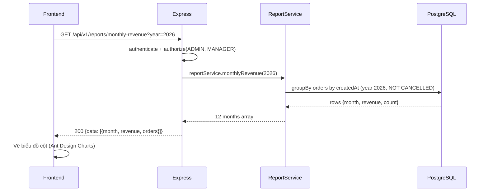
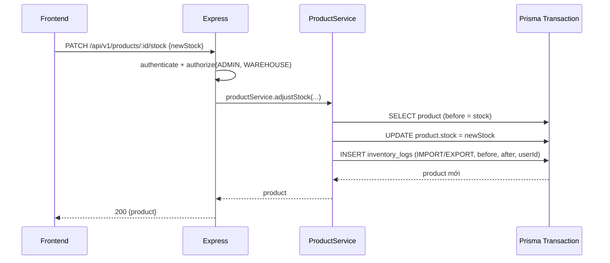
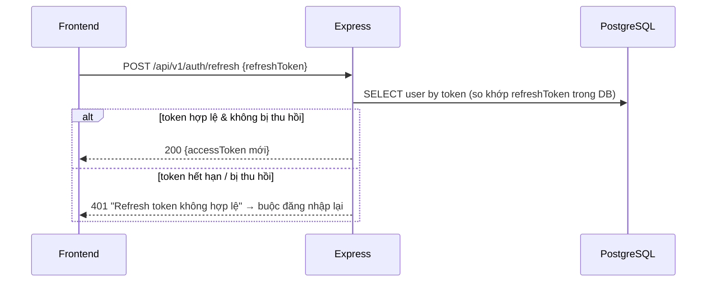

# Sequence Diagram

Các kịch bản tiêu biểu của hệ thống.

## 1. Đăng nhập & cấp token

## 2. Tạo đơn hàng (trừ tồn kho trong transaction)

## 3. Hủy đơn hàng (hoàn kho)

## 4. Xem báo cáo doanh thu

## 5. Điều chỉnh tồn kho (Nhân viên kho)

## 6. Refresh Token

