# Use Case Diagram

## 1. Actor (Tác nhân)

| Actor | Mô tả |
|---|---|
| **Admin** (`admin`) | Quản trị viên hệ thống, đầy đủ quyền nhất |
| **Nhân viên bán hàng** (`sales`) | Quản lý khách hàng, tạo đơn hàng, xem sản phẩm |
| **Nhân viên kho** (`warehouse`) | Cập nhật tồn kho, xem sản phẩm |
| **Quản lý** (`manager`) | Xem báo cáo, thống kê, doanh thu |

## 2. Sơ đồ Use Case (Mermaid)

```mermaid
graph TD
    subgraph "Hệ thống Balo - Túi xách"
        UC1[Đăng nhập / Đăng xuất]
        UC2[Đổi mật khẩu]
        UC3[Quản lý sản phẩm]
        UC4[Quản lý danh mục]
        UC5[Quản lý khách hàng]
        UC6[Tạo đơn hàng]
        UC7[Cập nhật trạng thái đơn]
        UC8[Xem chi tiết đơn hàng]
        UC9[Cập nhật tồn kho]
        UC10[Xem báo cáo doanh thu]
        UC11[Xem top sản phẩm bán chạy]
        UC12[Quản lý tài khoản]
        UC13[Dashboard tổng quan]
    end

    Admin(("Admin")) --> UC1
    Admin --> UC2
    Admin --> UC3
    Admin --> UC4
    Admin --> UC5
    Admin --> UC6
    Admin --> UC7
    Admin --> UC9
    Admin --> UC10
    Admin --> UC11
    Admin --> UC12
    Admin --> UC13

    Sales(("Nhân viên bán hàng")) --> UC1
    Sales --> UC2
    Sales --> UC5
    Sales --> UC6
    Sales --> UC7
    Sales --> UC8
    Sales --> UC3

    Warehouse(("Nhân viên kho")) --> UC1
    Warehouse --> UC2
    Warehouse --> UC9
    Warehouse --> UC7
    Warehouse --> UC3

    Manager(("Quản lý")) --> UC1
    Manager --> UC2
    Manager --> UC10
    Manager --> UC11
    Manager --> UC13
    Manager --> UC8
```

## 3. Bảng phân quyền theo Use Case

| Use Case | ADMIN | SALES | WAREHOUSE | MANAGER |
|---|:---:|:---:|:---:|:---:|
| UC1. Đăng nhập / Đăng xuất | ✅ | ✅ | ✅ | ✅ |
| UC2. Đổi mật khẩu | ✅ | ✅ | ✅ | ✅ |
| UC3. Quản lý sản phẩm | ✅ (full) | ✅ (xem) | ✅ (xem) | — |
| UC4. Quản lý danh mục | ✅ | — | — | — |
| UC5. Quản lý khách hàng | ✅ (full) | ✅ (CRUD) | — | — |
| UC6. Tạo đơn hàng | ✅ | ✅ | — | — |
| UC7. Cập nhật trạng thái đơn | ✅ | ✅ | ✅ | — |
| UC8. Xem chi tiết đơn hàng | ✅ | ✅ | ✅ | ✅ |
| UC9. Cập nhật tồn kho | ✅ | — | ✅ | — |
| UC10. Báo cáo doanh thu | ✅ | — | — | ✅ |
| UC11. Top sản phẩm bán chạy | ✅ | — | — | ✅ |
| UC12. Quản lý tài khoản | ✅ | — | — | — |
| UC13. Dashboard tổng quan | ✅ | — | — | ✅ |

## 4. Mô tả use case chính

### UC6 — Tạo đơn hàng
- **Actor**: Admin, Nhân viên bán hàng.
- **Tiền điều kiện**: đã đăng nhập, có quyền tạo đơn.
- **Luồng chính**:
  1. Chọn khách hàng (có sẵn trong hệ thống).
  2. Chọn sản phẩm + số lượng (nhiều dòng).
  3. Hệ thống kiểm tra tồn kho từng sản phẩm.
  4. Tính tổng tiền, tạo đơn hàng trạng thái `PENDING`.
  5. Trừ tồn kho + ghi `inventory_logs` (transaction).
- **Kết quả**: đơn hàng có mã `OD-YYYYMMDD-xxxxxx`, item, tổng tiền.

### UC7 — Cập nhật trạng thái đơn hàng
- **Luồng**: `PENDING → CONFIRMED → SHIPPING → COMPLETED` hoặc `PENDING → CANCELLED`.
- **Ngoại lệ**: khi hủy đơn `PENDING` → hệ thống tự **hoàn lại tồn kho** + ghi log CANCEL.

### UC9 — Cập nhật tồn kho
- **Actor**: Admin, Nhân viên kho.
- Chọn sản phẩm → nhập số tồn mới → hệ thống tính chênh lệch → ghi `inventory_logs` (IMPORT/EXPORT) kèm người thực hiện.